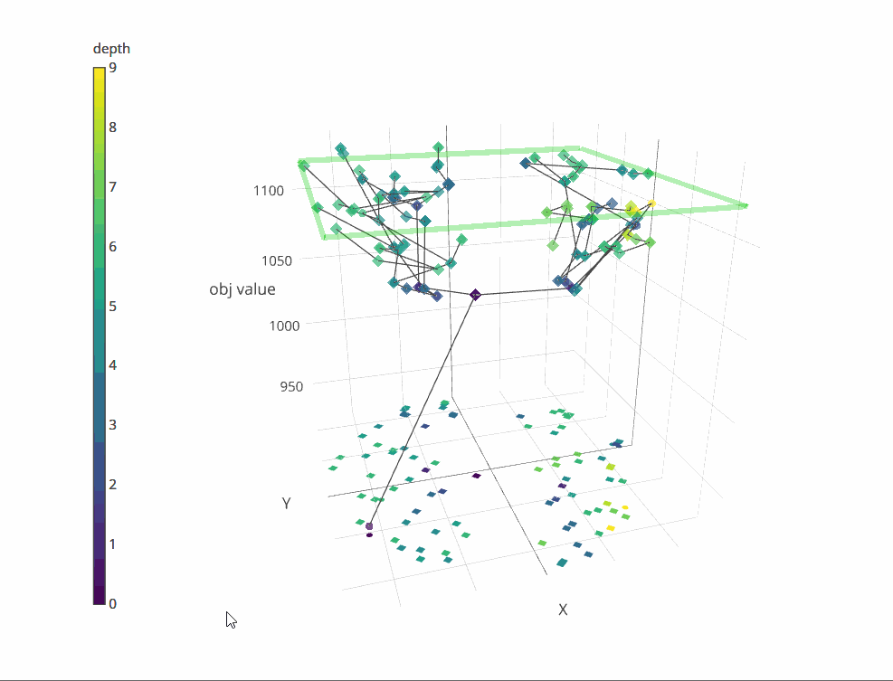
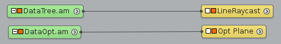
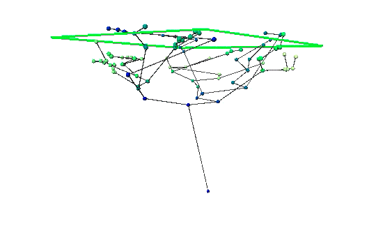

# TreeD

### Visual representation of the branch-and-cut tree of SCIP using spatial dissimilarities of LP solutions

## Usage:
- run `TreeD.py` to get usage information

## Dependencies:
- [PySCIPOpt](https://github.com/SCIP-Interfaces/PySCIPOpt) to solve the instance and generate the necessary tree data
- [Plot.ly](https://plot.ly/) to draw the 3D visualization
- [pandas](https://pandas.pydata.org/) to organize the collected data
- [sklearn](http://scikit-learn.org/stable/) for multi-dimensional scaling
- [pysal](https://github.com/pysal) to compute statistics based on spatial (dis)similarity

## Export to [Amira](https://amira.zib.de/):
- run `AmiraTreeD.py` to get usage information.

`AmiraTreeD.py` generates the '.am' data files to be loaded by Amira software to draw the tree using LineRaycast.

### Settings

- `DataTree.am`: SpatialGraph data file with tree nodes and edges.
- `LineRaycast`: Module to display the SpatialGraph. Note that is needed to set the colormap according to py code output (For instance 'Color map from 1 to 70' in this picture).
- `DataOpt.am`: SpatialGraph data file with optimun value.
- `Opt Plane`: Display the optimun value as a plane.
- `Local Axes`: Axes.

### Preview

