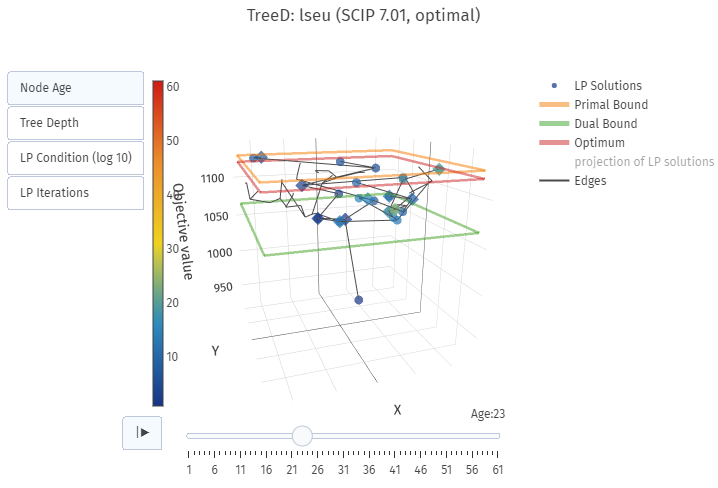

# TreeD

[](https://pypi.python.org/pypi/treed)

### Visual representation of the branch-and-cut tree of SCIP using spatial dissimilarities of LP solutions -- [Interactive Example](http://www.zib.de/miltenberger/treed-showcase.html)

[](https://plot.ly/~mattmilten/103/)

TreeD uses SCIP via PySCIPOpt to visualize the Branch-and-Cut tree traversed during the solution of a mixed-integer linear program (MIP or MILP). The LP solutions at each node are projected into a 2-dimensional space using a range of different transformation algorithms. Per default, multi-dimensional scaling (mds) is used. Other methods and further options can be displayed by running `python -m treed --help`. The 2-dimensional data points are visualized in a 3D space with regards to their respective LP solution value. Nodes higher up represent LP solutions with a higher value. These nodes are usually found later in the search and show the progress in increasing the lower or dual bound to close the MIP gap.

The color of the individual nodes is used to show different values like node age, LP iteration count, or LP condition number.

The shape of the nodes depict whether this LP solution was created through branching (🔵) or through LP resolves (🔷) at the ssame node, e.g. including cutting planes or added conflicts.

There is also a more traditional mode that ignores the spatial dimension and draws an abstract tree. This is activated via the method `draw2d()` or the command line flag `--classic`.

## Installation

```
python -m pip install treed
```

## Usage
- run `python -m treed --help` to get usage information or use this code snippet in a Jupyter notebook:

```
from treed import TreeD

treed = TreeD(
    probpath="model.mps",
    nodelimit=2000,
    showcuts=True
)

treed.solve()
fig = treed.draw()
fig.show(renderer='notebook')
```

There is also a (faster) 2D mode that skips the projection of LP solutions and generates a more traditional tree instead:

```
...
fig = treed.draw2d()
fig.show(renderer='notebook')
```

## Dependencies
- [PySCIPOpt](https://github.com/scipopt/PySCIPOpt) to solve the instance and generate the necessary tree data
- [Plotly](https://plot.ly/) to draw the 3D visualization
- [pandas](https://pandas.pydata.org/) to organize the collected data
- [sklearn](http://scikit-learn.org/stable/) for multi-dimensional scaling
- [pysal](https://github.com/pysal) to compute statistics based on spatial (dis)similarity; this is optional

## Export to [Amira](https://amira.zib.de/)
- run `AmiraTreeD.py` to get usage information.

`AmiraTreeD.py` generates the '.am' data files to be loaded by Amira software to draw the tree using LineRaycast.

### Settings


- `DataTree.am`: SpatialGraph data file with tree nodes and edges.
- `LineRaycast`: Module to display the SpatialGraph. Note that is needed to set the colormap according to py code output (For instance 'Color map from 1 to 70' in this picture).
- `DataOpt.am`: SpatialGraph data file with optimun value.
- `Opt Plane`: Display the optimal value as a plane.

### Preview


